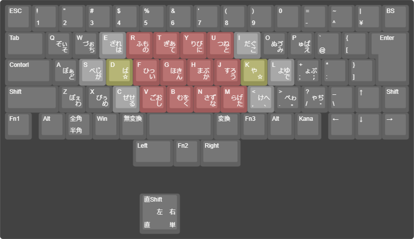

# 黒き月配列

## 黒き月配列について

黒き月配列は、月配列に代表される中指シフトを使用したかな入力配列です。

## 設計思想

### はじめに

より高速な日本語入力を追い求める配列は様々ありますが、そのほとんどは何かしらのキーとの同時押しを行うことで多彩な入力を可能にしています。

（マイナーなかな配列の亜種の中で）最も有名であると言えるのは親指シフトとの同時押しによる配列群でしょう。
NICOLAやTRONなどが例に挙げられます。

しかし、いくつかの理由でこれらの親指シフト配列はよくあるタイプのキーボードでは実装が難しくなっています。

1. 通常のキーボードには親指シフトキーがない
2. 通常のキーボードで実装するためにはエミュレータが必要
3. IMEだけ実装出来ない

これらのポイントから、（少なくとも私は）親指シフト系配列の導入を断念する他ありませんでした。

### 月配列との出会いと問題点

そういった背景から、

1. 通常のキーボードで実現できる
2. IMEだけで実現できる

の2点に重きをおいて配列の調査したところ、月配列に出会いました。

月配列は中指シフト前置式の配列であり、これなら1, 2の条件を満たしてくれますが、ここで一つ別の問題が発生しました。
記号の位置が別の場所に飛んでしまうことです。

元々覚えていた記号系に変更を加えたくなかったので、月配列を参考にして「黒き月配列」を作成しました。

### 設計

Comming soon...

## 使い方

`roman_table/`以下に`tsv`形式のテーブル定義ファイルがありますので、ご自由にお使いください。

## 概観

[Keyboard layout editor](http://www.keyboard-layout-editor.com/##@_backcolor=%23424242&name=%E6%97%A5%E6%9C%AC%E8%AA%9E%E5%85%A5%E5%8A%9B%E3%81%AE%E3%81%BF%2F_%E5%8D%98%E7%8B%AC%E6%89%93%E9%8D%B5&author=Yuni%20Hutsuka%3B&@_c=%23616161&t=%23ffffff%3B&=ESC&=!%0A1&=%22%0A2&=%23%0A3&=$%0A4&=%25%0A5&=%2F&%0A6&='%0A7&=(%0A8&=)%0A9&=0&=%2F=%0A-&=~%0A%5E&=%7C%0A%C2%A5&=BS%3B&@_w:1.5%3B&=Tab&_c=%23474747%3B&=%E3%81%9E%0A%0A%E3%81%83%0A%0A%0A%0A%0A%0A%0A%0A%E3%81%9D&=%E3%81%A5%0A%0A%E3%81%89%0A%0A%0A%0A%0A%0A%0A%0A%E3%81%A1&=%E3%81%96%0A%0A%E3%82%8C%0A%0A%0A%0A%0A%0A%0A%0A%E3%81%AF&=%E3%81%B5%0A%0A%E3%82%82%0A%0A%0A%0A%0A%0A%0A%0A%E3%81%AE&=%E3%81%8E%0A%0A%E3%81%82%0A%0A%0A%0A%0A%0A%0A%0A%E3%81%A6&=%E3%82%8A%0A%0A%E3%81%B3%0A%0A%0A%0A%0A%0A%0A%0A%E3%81%AB&=%E3%81%A4%0A%0A%E3%81%AD%0A%0A%0A%0A%0A%0A%0A%0A%E3%81%A8&=%E3%81%A0%0A%0A%E3%81%90%0A%0A%0A%0A%0A%0A%0A%0A%E3%81%93&=%E3%81%AC%0A%0A%E3%82%94%0A%0A%0A%0A%0A%0A%0A%0A%E3%81%BF&=%E3%82%85%0A%0A%E3%81%B1%0A%0A%0A%0A%0A%0A%0A%0A%E3%81%88&_c=%23616161%3B&=%60%0A%2F@&=%7B%0A%5B&_x:0.25&w:1.25&h:2&w2:1.5&h2:1&x2:-0.25%3B&=Enter%3B&@_w:1.75%3B&=Contorl&_c=%23474747%3B&=%E3%81%BC%0A%0A%E3%81%81%0A%0A%0A%0A%0A%0A%0A%0A%E3%81%A9&=%E3%81%B9%0A%0A%E3%81%98%0A%0A%0A%0A%0A%0A%0A%0A%E3%81%8C&=%0A%0A%E3%81%B0%0A%0A%0A%0A%0A%0A%0A%0A%E2%98%86&=%E3%81%B2%0A%0A%E3%81%A3%0A%0A%0A%0A%0A%0A%0A%0A%E3%81%84&=%E3%81%BB%0A%0A%E3%81%8D%0A%0A%0A%0A%0A%0A%0A%0A%E3%82%93&=%E3%81%BE%0A%0A%E3%81%B6%0A%0A%0A%0A%0A%0A%0A%0A%E3%81%8B&=%E3%81%99%0A%0A%E3%82%8D%0A%0A%0A%0A%0A%0A%0A%0A%E3%81%86&=%E3%82%84%0A%0A%0A%0A%0A%0A%0A%0A%0A%0A%E2%98%86&=%E3%82%88%0A%0A%E3%82%86%0A%0A%0A%0A%0A%0A%0A%0A%E3%81%A7&=%E3%82%87%0A%0A%E3%81%B7%0A%0A%0A%0A%0A%0A%0A%0A%EF%BC%9B&_c=%23616161%3B&=*%0A%2F:&=%7D%0A%5D%3B&@_w:2%3B&=Shift&_c=%23474747%3B&=%E3%81%BD%0A%0A%E3%81%87%0A%0A%0A%0A%0A%0A%0A%0A%E3%82%8F&=%E3%81%B4%0A%0A%E3%81%85%0A%0A%0A%0A%0A%0A%0A%0A%E3%82%81&=%E3%81%9C%0A%0A%E3%81%9B%0A%0A%0A%0A%0A%0A%0A%0A%E3%82%8B&=%E3%81%94%0A%0A%E3%81%8A%0A%0A%0A%0A%0A%0A%0A%0A%E3%81%97&=%E3%82%80%0A%0A%E3%82%92%0A%0A%0A%0A%0A%0A%0A%0A%E3%81%8F&=%E3%81%95%0A%0A%E3%81%9A%0A%0A%0A%0A%0A%0A%0A%0A%E3%81%AA&=%E3%82%89%0A%0A%E3%81%92%0A%0A%0A%0A%0A%0A%0A%0A%E3%81%9F&=%E3%81%91%0A%0A%E3%81%B8%0A%0A%0A%0A%0A%0A%0A%0A%E3%80%81&=%E3%81%BA%0A%0A%E3%82%8E%0A%0A%0A%0A%0A%0A%0A%0A%E3%80%82&=%E3%82%83%0A%0A%E3%81%A2%0A%0A%0A%0A%0A%0A%0A%0A%E3%83%BB&_c=%23616161%3B&=%2F_%0A%5C&=%E2%86%91&=Shift%3B&@=Fn1&_x:0.25%3B&=Alt&=%E5%85%A8%E8%A7%92%0A%E5%8D%8A%E8%A7%92&=Win&=%E7%84%A1%E5%A4%89%E6%8F%9B&_a:7&w:2.5%3B&=&_a:4%3B&=%E5%A4%89%E6%8F%9B&=Fn3&=Alt&=Kana&_x:0.25%3B&=%E2%86%90&=%E2%86%93&=%E2%86%92%3B&@_x:4.75&w:1.5%3B&=Left&=Fn2&_w:1.5%3B&=Right%3B&@_y:1&x:5&a:7&w:1.5&h:1.5%3B&=%E5%8D%98)

